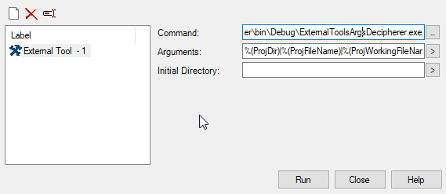
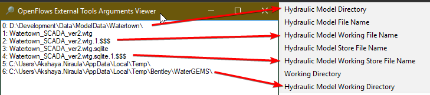

# Understand different macros and their values in External Tools of GEMS application

## How to run the tool

Launch the External Tool in GEMS application, fill the Command and Arguments like below:
Command: Path to the Exe file that you downloaded from this repo
Arguments: Separate all arguments by pipe symbol '|'


When you click on the Run button you will see the UI like below



## What's in the [Form1.cs](Form1.cs)
```c#
public partial class Form1 : Form
{
    public Form1(string[] args)
    {
        InitializeComponent();

        Text = "OpenFlows External Tools Arguments Viewer";
        Icon = IconExtractor.Extract("shell32.dll", 209, false);
        Args = args;
    }

    protected override void OnLoad(EventArgs e)
    {
        if (Args.Length <= 0)
            return;
                    
        Args = Args[0].Split('|');

        for (int i = 0; i < Args.Length; i++)
        {
            var message = $"{i}: {Args[i]} {Environment.NewLine}";

            textBox.AppendText( message);
            Console.WriteLine(message);
        }


        base.OnLoad(e);
    }


    private string[] Args { get; set; }
}
```